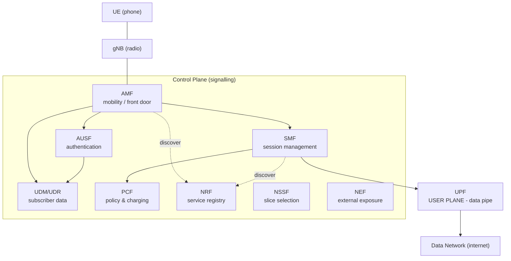

# 01 — Architecture Big Picture (SBA)

## 🧠 The One Idea

**The 5G core is built like a modern web backend: a set of microservices that each expose a REST
API and find each other through a shared phone book.** Instead of fixed point-to-point cables
between boxes (the old telecom way), every **Network Function (NF)** offers its services over
**HTTP/2**, registers itself in a registry (**NRF**), and calls whoever it needs. That's the
**Service-Based Architecture (SBA)**.

The common one-liner: **"5G's core is a Service-Based Architecture — NFs are microservices
calling each other over HTTP/2 APIs, discovered via the NRF."**

---

## 1. Network Functions (NFs) = microservices

- An **NF** is a single responsibility service (AMF = mobility, SMF = sessions, …).
- Each NF exposes **service-based interfaces (SBIs)** — RESTful HTTP/2 + JSON APIs named like
  **Namf**, **Nsmf**, **Nudm**, etc. (the `N<nf>` naming).
- NFs are **stateless-ish at the edge, stateful underneath**: they keep subscriber/session state
  in a shared data layer so any instance can serve any request (more in Lesson 04 & 07).

This is exactly a microservices pattern — which is why a 5G core runs naturally on Kubernetes.

---

## 2. Producer / consumer model

- Any NF can be a **service producer** (offers an API) and a **service consumer** (calls others).
- Example: the **AMF** (consumer) calls the **AUSF** (producer) to authenticate a user, then
  calls the **SMF** (producer) to set up a data session.
- Calls are **request/response over HTTP/2**, plus a **subscribe/notify** pattern for events
  (e.g. "tell me when this subscriber's data changes").

---

## 3. The NRF — the phone book

- The **NRF (Network Repository Function)** is the **service registry/discovery** for the whole
  core.
- Every NF **registers** itself ("I'm an SMF, here's my address and what I support") and
  **discovers** others ("find me an SMF that handles this slice").
- It's the 5G equivalent of service discovery (like Kubernetes DNS / a service registry) — no
  hard-coded peer addresses.

---

## 4. The cast of characters (one diagram)

Solid arrows = control signalling (HTTP/2). The **UPF** sits apart — it carries the **actual
user data** from the radio to the internet.

---

## 5. Why SBA matters (the design wins)

- **Independent scaling & upgrades** — scale or redeploy the AMF without touching the SMF.
- **Reuse** — one NF's API serves many consumers (UDM's profile API is used by AMF, SMF, AUSF…).
- **Cloud-native ops** — health checks, rolling upgrades, autoscaling, observability — standard
  Kubernetes machinery applies.
- **Vendor mix** — standard APIs let NFs from different vendors interoperate.

**The trade-off:** lots of inter-service HTTP calls → you need solid service discovery, retries,
timeouts, and observability — which is exactly what a shared service framework provides
once, for every NF.

---

## 🎤 Say this in the interview

- *"5G uses a **Service-Based Architecture**: each **Network Function** is a microservice exposing
  an HTTP/2 REST API (`N<nf>`), and they discover each other via the **NRF** registry."*
- *"NFs are **producers and consumers** with request/response plus subscribe/notify; there are no
  hard-coded peers — discovery is dynamic."*
- *"It's microservices for telecom, so it runs on Kubernetes and needs solid comm, discovery,
  retries, and observability — which a shared service framework standardizes."*

➡️ **Next:** [02 — AMF: the front door](./02_AMF.md)
