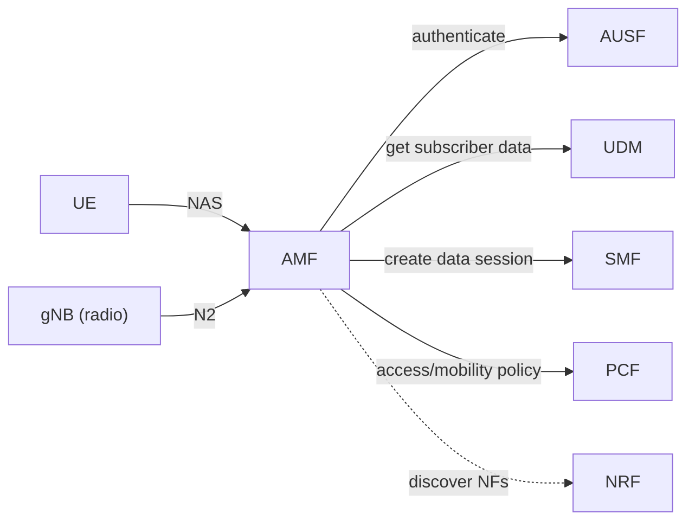

# 02 — AMF: the Front Door

## 🧠 The One Idea

**The AMF is the receptionist at the building's front desk: it greets your phone, checks it in,
remembers where it is, and routes its paperwork to the right department.** Every phone talks to
exactly one AMF at a time. The AMF doesn't handle your data packets — it handles the
**signalling**: registering you, keeping the connection, and tracking your movement.

The common one-liner: **"The AMF is the control-plane entry point — it handles registration,
mobility, and connection management for the UE."**

AMF = **Access and Mobility Management Function**.

---

## 1. What the AMF does

- **Registration management** — when your phone powers on, it **registers** with the network
  through the AMF ("I'm here, here's my identity"). The AMF is the endpoint for this.
- **Connection management** — maintains the signalling connection between the UE and the core;
  knows whether the UE is *idle* or *connected*.
- **Mobility management** — as you move between towers/areas, the AMF tracks your location
  (registration/tracking areas) and handles **handovers** so the connection survives movement.
- **Reachability / paging** — if the network needs to reach an idle phone (incoming data), the
  AMF **pages** it to wake it up.
- **NAS signalling termination** — it terminates the **NAS** (Non-Access Stratum) messages: the
  direct control conversation between the UE and the core.

---

## 2. What the AMF does NOT do

- It does **not** carry user data (that's the **UPF**).
- It does **not** set up the data session itself — it **delegates** session work to the **SMF**.
- It does **not** store your permanent profile or do the crypto math — it **asks** the **AUSF**
  and **UDM**.

The AMF is a **coordinator/router of signalling**, not a data mover or a database.

---

## 3. Who the AMF talks to

- **UE ↔ AMF:** NAS signalling (the control conversation).
- **gNB ↔ AMF:** the **N2** interface (radio control to core).
- **AMF → AUSF/UDM:** authenticate the user and fetch the subscription profile.
- **AMF → SMF:** "this user wants a data session — please set it up."
- **AMF → PCF:** access and mobility policy (e.g. allowed areas).

---

## 4. The mental model in one line

When you switch your phone on, **the AMF is the first core NF that "meets" you** and stays your
anchor point for all signalling until you deregister or move to another AMF. Think *front-desk
concierge*: checks you in, calls the right departments, and keeps your file open.

---

## 🎤 Say this in the interview

- *"The **AMF** is the control-plane front door: **registration, connection, and mobility
  management**, plus paging and terminating **NAS** signalling from the UE."*
- *"It **coordinates** — it authenticates via **AUSF/UDM** and hands session setup to the
  **SMF** — but it never touches **user data**; that's the **UPF**."*
- *"One UE is served by one AMF at a time; it's the anchor for all signalling and handovers."*

➡️ **Next:** [03 — SMF & UPF: sessions & the data pipe](./03_SMF_And_UPF.md)
