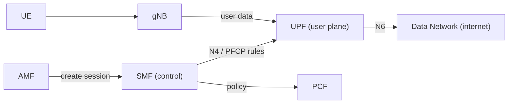

# 03 — SMF & UPF: Sessions & the Data Pipe

## 🧠 The One Idea

**The SMF is the plumber who installs your water line; the UPF is the pipe the water actually
flows through.** When your phone wants internet, the **SMF** *sets up and manages* a data session
and decides how it should behave; the **UPF** is the box your packets physically pass through on
their way to the internet. SMF = control (decisions), UPF = user plane (the actual data).

The common one-liner: **"SMF manages the session; UPF forwards the packets — control vs user
plane in action."**

SMF = **Session Management Function**. UPF = **User Plane Function**.

---

## 1. The SMF — session manager

- Sets up, modifies, and tears down **PDU sessions** — a **PDU session** is the logical data
  connection between your phone and the internet (it's what gets you an **IP address**).
- **Allocates the UE's IP address** for the session.
- **Selects and controls the UPF(s)** that will carry the data, and programs forwarding rules
  into them.
- Talks to the **PCF** to get **policy and charging rules** (speed limits, quotas) and enforces
  them via the UPF.
- Handles session-level events: QoS changes, more UPFs as you move, session release.

Think of the SMF as the **session brain**: it decides *how* your data path is built and behaves,
but never carries the data itself.

---

## 2. The UPF — the data pipe

- The **UPF** is the **user-plane workhorse**: it **forwards user packets** between the radio
  (gNB) and the **Data Network (DN)** — the internet or a private network.
- It does **packet routing & forwarding, QoS enforcement** (rate limiting per the rules SMF
  installs), **usage measurement** (for charging), and is the **PDU session anchor**.
- It can be deployed **at the edge**, close to users, for **low latency** — this is a headline
  5G capability (e.g. for AR/VR, gaming, industrial control).

The UPF is the **only** NF on the actual data path — everything else is signalling.

---

## 3. How SMF and UPF talk: N4 / PFCP

- The SMF controls the UPF over the **N4 interface** using the **PFCP** protocol.
- The model is **packet forwarding rules**: SMF says "for this session, match these packets,
  apply this QoS, forward here, count usage" and the UPF executes it.
- This is the cleanest example of **CUPS** (Control/User Plane Separation): one SMF can control
  **many** UPFs, and UPFs scale independently of the control plane.

Notice: signalling goes AMF → SMF → (N4) → UPF, but **user data** rides gNB → UPF → internet.

---

## 4. The key interfaces to name (quick reference)

| Interface | Between | Carries |
|---|---|---|
| **N4** | SMF ↔ UPF | session/forwarding rules (PFCP) |
| **N3** | gNB ↔ UPF | user data (radio → user plane) |
| **N6** | UPF ↔ Data Network | user data (to the internet) |
| **N9** | UPF ↔ UPF | user data between UPFs |
| **N11** | AMF ↔ SMF | session setup signalling |

---

## 🎤 Say this in the interview

- *"The **SMF** manages **PDU sessions** — it allocates the UE IP, selects and programs the
  **UPF**, and pulls policy from the **PCF**. The **UPF** is the user-plane box that actually
  **forwards packets** to the internet."*
- *"They split over **N4/PFCP**: one SMF controls many UPFs — that's **CUPS**, so the data plane
  scales independently and can sit at the **edge** for low latency."*
- *"User data only ever touches the **UPF** (N3 in from radio, N6 out to the internet); the SMF
  is pure control."*

➡️ **Next:** [04 — Subscriber data & auth](./04_Subscriber_Data_And_Auth.md)
