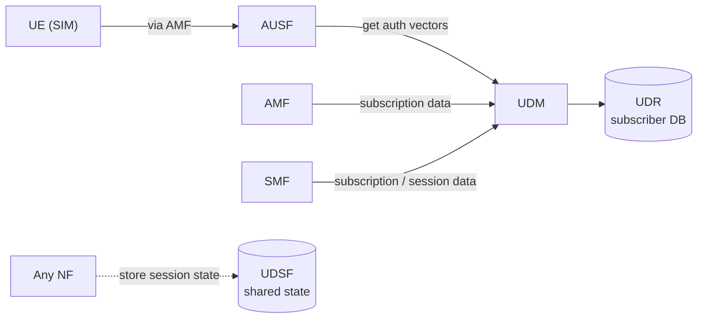

# 04 — Subscriber Data & Auth (AUSF, UDM, UDR, UDSF)

## 🧠 The One Idea

**Before the network trusts your phone, it checks your ID against the master records — like a
bank verifying your card and PIN against its database.** The **UDM/UDR** are the master records
(who you are, what you're subscribed to, your secret key); the **AUSF** is the security guard who
runs the challenge to prove your SIM is genuine. Nobody gets data service until this passes.

The common one-liner: **"UDM/UDR hold subscriber data; AUSF authenticates the SIM — identity and
proof before any service."**

---

## 1. UDM — Unified Data Management

- The **UDM** is the authority on **subscriber identity and subscription**: your profile, what
  services/slices you're allowed, your data plan, and the **authentication credentials**.
- It **generates authentication vectors** (the challenge material) used to verify your SIM.
- Other NFs ask the UDM things like: *"what is this subscriber allowed to do?"* (AMF, SMF) and
  *"give me auth material for this user"* (AUSF).
- It's **stateless compute over a backing store** — the actual data lives in the **UDR**.

---

## 2. UDR — Unified Data Repository

- The **UDR** is the **database** behind the UDM (and others): subscription data, policy data,
  and more, stored persistently.
- **UDM vs UDR:** UDM = the **logic/front-end** ("understand and serve subscriber data"); UDR =
  the **storage** ("hold the bytes"). Splitting them lets multiple front-ends share one
  consistent data store.

---

## 3. AUSF — Authentication Server Function

- The **AUSF** runs the **authentication** of the UE for the home network: it takes the auth
  material from the UDM and performs the **challenge–response** (5G-AKA / EAP-AKA') with the
  phone, via the AMF.
- Outcome: the network confirms the SIM is genuine **and** the phone confirms it's talking to a
  legitimate network (**mutual authentication**), and they derive the **keys** used to encrypt
  signalling and data.
- Flow in one line: **AMF → AUSF → UDM** for the vectors, then AUSF drives the challenge back to
  the UE through the AMF.

---

## 4. UDSF — Unstructured Data Storage Function (the "shared state" NF)

- The **UDSF** lets NFs store their **runtime/session state** in a **shared, external store** so
  the NF instances themselves can be **stateless and replaceable**.
- Why it matters: if an NF instance dies, another instance reads the session state from the UDSF
  and carries on — **no dropped sessions**. This is the standard 5G pattern for resilient,
  horizontally-scaled NFs.

---

## 5. One picture

---

## 6. The mental model

- **Who are you?** → UDM/UDR (the records).
- **Prove it.** → AUSF (the challenge).
- **Where do NFs keep live session state so they can fail over?** → UDSF (shared store).

Identity and authentication are the **gate**; everything else (sessions, policy, data) only
happens after you're through it.

---

## 🎤 Say this in the interview

- *"**UDM/UDR** are subscriber identity and subscription — UDM is the logic, UDR is the data
  store. **AUSF** authenticates the SIM via 5G-AKA, with mutual auth and key derivation."*
- *"The order is **AMF → AUSF → UDM** for auth vectors, then the challenge runs back to the UE
  through the AMF."*
- *"The **UDSF** holds NF session state externally so instances stay stateless and can fail over
  — the same idea as any distributed session datastore."*

➡️ **Next:** [05 — Policy, discovery & slicing](./05_Policy_Discovery_Slicing.md)
