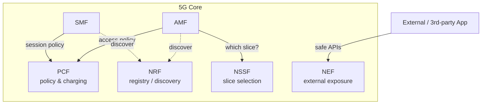

# 05 — Policy, Discovery & Slicing (PCF, NRF, NSSF, NEF)

## 🧠 The One Idea

**These four are the "management" functions of the network: the rulebook, the phone book, the
maître d', and the reception window to the outside world.** PCF sets the rules (speed, quota),
NRF is how NFs find each other, NSSF picks which *slice* of the network you belong to, and NEF is
the safe door that lets outside applications talk to the network.

The common one-liner: **"PCF = policy, NRF = discovery, NSSF = slice selection, NEF = external
exposure."**

---

## 1. PCF — Policy Control Function

- The **PCF** is the **rulebook**: it decides **QoS** (how fast/prioritized your traffic is),
  **charging** (how you're billed), and **usage limits/quotas**.
- The **SMF** asks the PCF for the rules of a session, then **enforces** them via the **UPF**.
- The **AMF** asks the PCF for **access and mobility** policy (e.g. which areas you may use).
- Think *traffic cop + billing department*: it makes the policy decisions; SMF/UPF carry them out.

---

## 2. NRF — Network Repository Function

- The **NRF** is the **service registry / discovery** for the whole core (covered in Lesson 01).
- NFs **register** themselves and **discover** others ("find me an SMF for this slice"), so there
  are **no hard-coded addresses**.
- It's the 5G analog of service discovery in a microservices platform — the **phone book**.

---

## 3. NSSF — Network Slice Selection Function

- **Network slicing** = running **multiple logical networks on one physical network**, each tuned
  for a use case (fast broadband vs ultra-reliable cars vs massive IoT — the eMBB/URLLC/mMTC from
  Lesson 00).
- A slice is identified by an **S-NSSAI**. The **NSSF** decides **which slice(s)** a UE should
  use and **which set of NF instances** serve that slice.
- Analogy: the **maître d'** who seats you in the right section of the restaurant (quiet, family,
  fast-service) based on your reservation.

---

## 4. NEF — Network Exposure Function

- The **NEF** is the **safe API gateway to the outside**: it **exposes** selected network
  capabilities to **external/third-party applications** (e.g. an enterprise app requesting a QoS
  boost, or getting device location/events) **without** exposing the core directly.
- It **translates and polices** those external calls — authentication, throttling, hiding
  internal topology.
- Analogy: the **reception window** — outsiders make requests there; it never lets them wander the
  building.

---

## 5. One picture

---

## 6. The mental model

- **What are the rules for this session?** → PCF
- **Where do I find an NF that does X?** → NRF
- **Which slice serves this device?** → NSSF
- **How does an outside app safely ask the network for something?** → NEF

---

## 🎤 Say this in the interview

- *"**PCF** is policy & charging — SMF pulls session rules and enforces them in the UPF; AMF pulls
  access/mobility policy."*
- *"**NRF** is service discovery (the registry), **NSSF** selects the **network slice**
  (S-NSSAI), and **NEF** safely exposes network capabilities to external apps."*
- *"**Slicing** lets one physical network run many logical networks — eMBB, URLLC, mMTC — each
  with its own NF set and guarantees."*

➡️ **Next:** [06 — End-to-end call flow](./06_End_To_End_Call_Flow.md)
