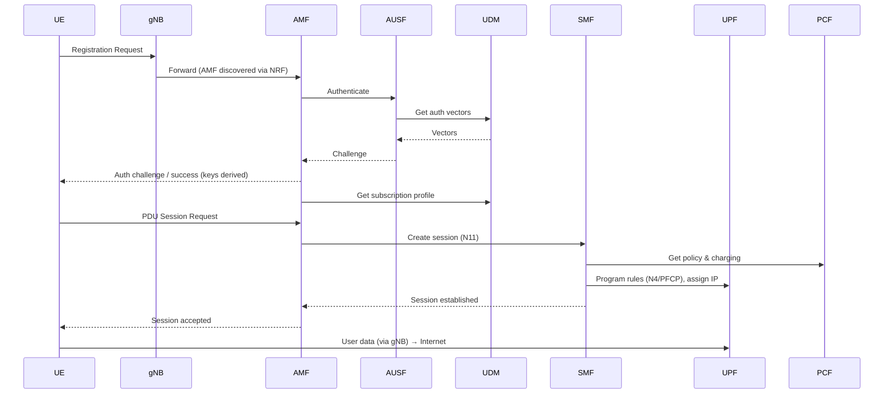

# 06 — End-to-End Call Flow

## 🧠 The One Idea

**Watch one phone power on and get online, and every NF you've learned plays its part in order —
like checking into a hotel: reception, ID check, room assignment, then the door opens.** This
single story ties AMF, AUSF, UDM, SMF, UPF, PCF, and NRF together. If you can narrate it, you
understand the 5G core.

The common one-liner: **"Registration → authentication → PDU session setup → data flows through
the UPF."**

---

## 1. Phase 1 — Registration (check in)

1. Your phone (**UE**) powers on and sends a **Registration Request** over the radio (**gNB**) to
   an **AMF** (the gNB picks an AMF, using the **NRF** to discover one).
2. The **AMF** becomes your signalling anchor and starts the check-in.

*Receptionist greets you and opens your file.*

---

## 2. Phase 2 — Authentication (ID check)

3. The **AMF** asks the **AUSF** to authenticate you.
4. The **AUSF** fetches **authentication vectors** from the **UDM** (which reads the **UDR**).
5. A **challenge–response** (5G-AKA) runs between the network and your SIM, via the AMF. Both
   sides prove themselves (**mutual auth**) and derive **encryption keys**.
6. The AMF pulls your **subscription profile** from the **UDM** ("what is this user allowed?").

*Security verifies your ID and your card's PIN; your account details are loaded.*

---

## 3. Phase 3 — PDU session establishment (get a room + a key)

7. To use data, the UE requests a **PDU session**; the **AMF** selects an **SMF** (via **NRF**)
   and forwards the request (**N11**).
8. The **SMF** allocates the UE's **IP address** (IPAM), and asks the **PCF** for **policy and
   charging rules** for the session.
9. The **SMF** selects a **UPF** and programs it over **N4/PFCP** with the forwarding + QoS rules.
10. The session is confirmed back to the UE.

*You're assigned a room, billing is set up, and your key card is programmed.*

---

## 4. Phase 4 — Data flows (the door opens)

11. User traffic now flows **UE → gNB → UPF → Data Network (internet)** entirely on the **user
    plane**. The control-plane NFs are no longer in the packet path.

*You walk through your door — reception isn't involved anymore.*

---

## 5. What happens later (mobility & teardown, briefly)

- **You move:** the **AMF** handles **handover** between gNBs; if you move far, the **SMF** may add
  or switch **UPFs** to keep the data path efficient (e.g. an edge UPF).
- **You go idle:** the connection is released to save resources; incoming data triggers the AMF to
  **page** you back.
- **You disconnect:** the SMF **releases** the PDU session and frees the IP/UPF resources.

---

## 🎤 Say this in the interview

- *"Power-on flow: **register** with the AMF (found via NRF) → **authenticate** via AUSF/UDM with
  5G-AKA and key derivation → **establish a PDU session** where the SMF gets policy from the PCF
  and programs a UPF → **data flows** UE→gNB→UPF→internet on the user plane."*
- *"After setup the **control plane is out of the data path** — only the UPF carries packets."*
- *"Mobility is the AMF's job (handover/paging); adding/switching UPFs as you move is the SMF's."*

➡️ **Next:** [08 — Interview Q&A flashcards](./08_Interview_QA_Flashcards.md)
